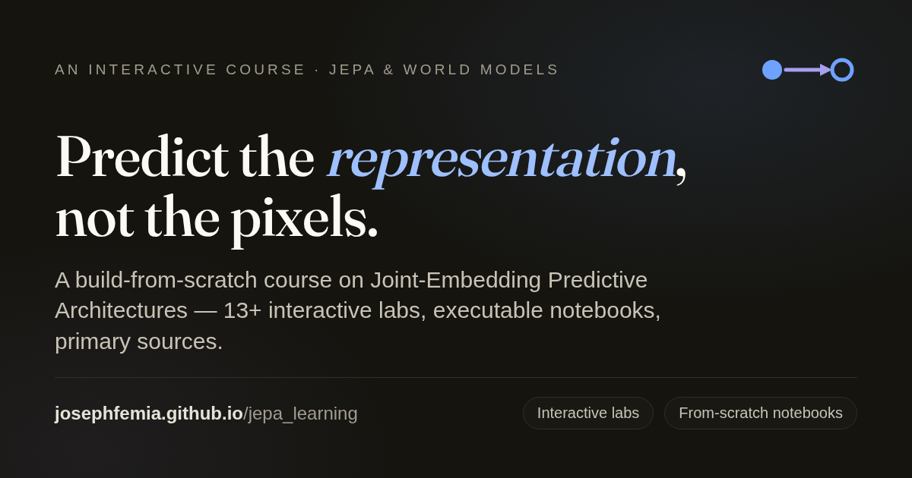

# Predict the Representation — An Interactive JEPA Course

**→ Live: [josephfemia.github.io/jepa_learning](https://josephfemia.github.io/jepa_learning/)**  ·  [Jump to the from-scratch labs](https://josephfemia.github.io/jepa_learning/#labs)



An interactive, single-page course that takes you from a **basic machine-learning background** to **JEPA and world-model fluency** — approaching ML-researcher depth. It's built around one thesis, the one Yann LeCun keeps returning to:

> **Predict the representation, not the pixels.**

Most self-supervised models waste capacity reconstructing every pixel — including the unpredictable noise. JEPA (Joint-Embedding Predictive Architecture) predicts in a learned *latent* space instead, so the model spends its budget on what's actually predictable about the world. This course builds that idea up from scratch, *no black boxes*.

## What makes it different

It deliberately mixes three learning modes so it never becomes a wall of text:

- **📖 Read** — concept-first explanations in an Andrej Karpathy "build-from-scratch, concrete-before-abstract" voice.
- **🧪 Interact** — **13+ hands-on labs and diagrams**: pixel-vs-latent reconstruction, masking strategies, representation *collapse* (and the tricks that prevent it), contrastive-vs-regularized objectives, a latent-space CEM planner, the H-JEPA hierarchy, a model explorer, and more — all original SVG/Canvas, no external assets.
- **🧠 Remember** — learning-science tactics baked in: predict-first prompts, discovery sequencing, spaced-retrieval checkpoints, and dual coding.

Plus **executable from-scratch notebooks** (`#labs`) and an accuracy bar where **every numeric or named claim traces to a primary source.**

## What you'll learn

`The core idea` → `why latent prediction wins` → `building a JEPA` → `representation collapse & how to avoid it` → `under the hood (objectives & math)` → `JEPA vs. the alternatives` → `the research timeline` → `the model family (I-JEPA, V-JEPA, …)` → `world models & planning` → `recap`.

## Quick start

```bash
npm install
npm run dev      # http://localhost:5173
```

```bash
npm run build    # production build → dist/
npm run preview  # preview the production build
npm test         # Vitest unit tests (quiz scoring + CEM planner)
```

Requires Node 18+.

## Deploy (GitHub Pages)

A GitHub Actions workflow ([`.github/workflows/deploy.yml`](.github/workflows/deploy.yml)) builds and
publishes to GitHub Pages on every push to `master`/`main`. No manual config is needed: hash routing
(`#labs`) requires no SPA rewrites, and `vite.config.js` reads `base` from `VITE_BASE`, which the
workflow derives automatically from the repository name (`/<repo>/` for a project page, `/` for a
`<user>.github.io` page). The workflow also enables Pages itself.

One-time setup — create a **public** repo (free Pages requires public), then:

```bash
git remote add origin https://github.com/<USER>/<REPO>.git
git push -u origin master        # use `git branch -M main` first if you prefer main
```

When the **Actions → Deploy to GitHub Pages** run is green, the site is live at
`https://<USER>.github.io/<REPO>/` (and `/#labs` for the notebooks).

(If a run ever fails with a Pages 404, enable Settings → Pages → Source: **GitHub Actions**, then re-run.)

## Stack

- **Vite** + **React 18**, a tiny hash router (`#labs` → the from-scratch notebooks page, else the course)
- **Tailwind CSS** (core utilities + arbitrary values via JIT)
- No runtime dependencies. One web font (**Fraunces**, the display serif); body/mono use the native system stacks.

## Project structure

```
.
├── index.html              # Vite entry (+ Open Graph / Twitter card meta)
├── vite.config.js
├── tailwind.config.js      # scans index.html + src/**
├── public/
│   ├── og-image.png        # social share card
│   └── notebooks/          # executed from-scratch .ipynb (served at /notebooks)
├── src/
│   ├── main.jsx            # React root → renders <JepaCourse />
│   ├── theme.js            # DARK/LIGHT palettes + ThemeContext  ("Editorial Apple")
│   ├── data.js             # course data (SECTIONS, TIMELINE, MODELS, …)
│   ├── logic.js            # pure, tested helpers (scoreQuiz, planCEM, …)
│   └── JepaCourse.jsx      # the course: components, labs, layout
└── PROJECT_BRIEF.md        # full handoff doc for extending the project
```

See `PROJECT_BRIEF.md` for a complete map of the codebase and guidance on extending it.

## Notes

- Dark/light theme via React context (no `localStorage`; SSR-safe by design).
- All diagrams/animations are original SVG/Canvas; canvas effects respect `prefers-reduced-motion`.
- Diagrams are faithful *schematics* of the underlying mechanisms, not literal training traces.

## License

Dual-licensed:

- **Code** (source, build config, tooling) — **MIT**, see [`LICENSE`](LICENSE).
- **Course content** (text, diagrams, animations) — **CC BY 4.0**, see [`LICENSE-CONTENT.md`](LICENSE-CONTENT.md).

In short: reuse the code freely, and share or adapt the course content as long as you credit Joseph Femia.
